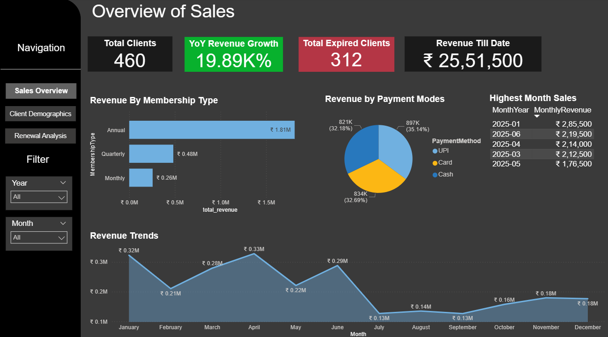
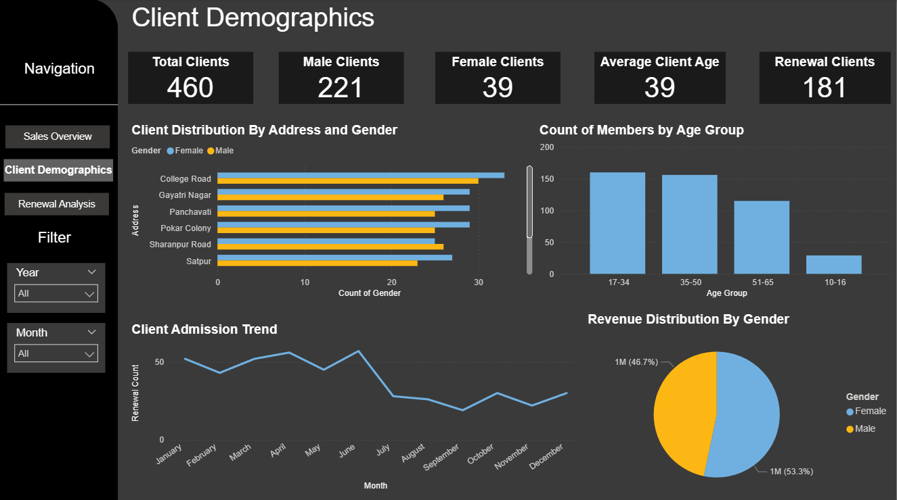
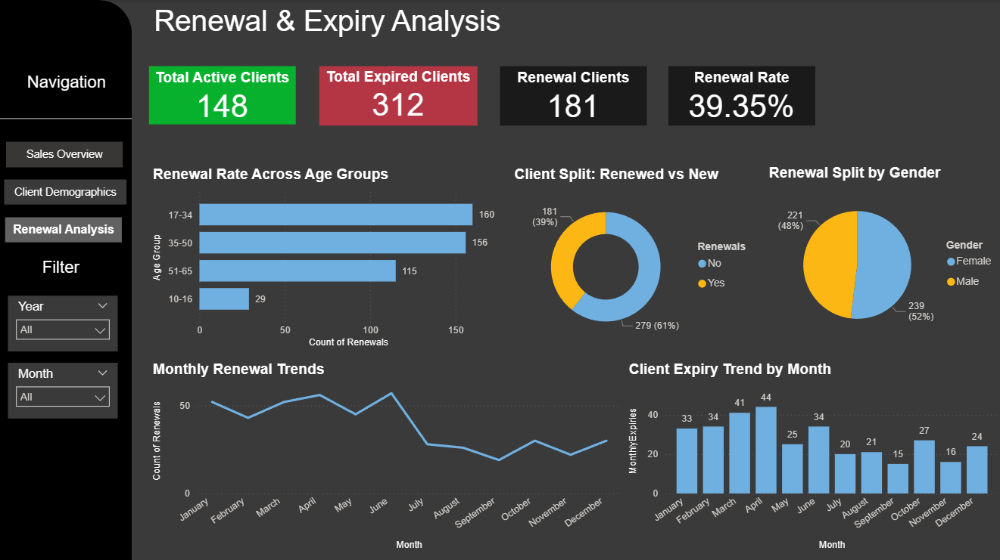

# Gym-Sales-Retention-Analysis

-Boosted revenue insight by 71% via K-means clustering, revealing that 33% of high-value premium members drive the
majority of sales.

-Predicted and mitigated churn by identifying 214 at risk customers using Linear Regression on 460+ member records,
enabling targeted retention campaigns with ₹3.4L upgrade revenue potential.

-Built an interactive Power BI dashboard with predictive analytics, customer segmentation, and renewal-risk analysis
using DAX calculations and Power Query data transformation, resulting in a 15% improvement in client retention.

Dashboard Screenshots:

📌 **Disclaimer:** Due to data privacy reasons, source data files and Power BI (.pbix) file are not included in this repository.
