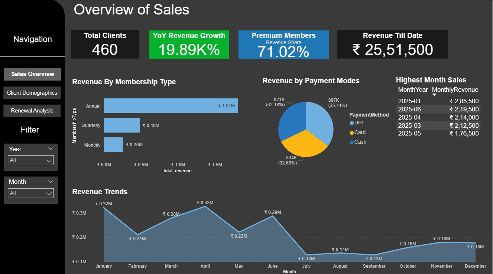
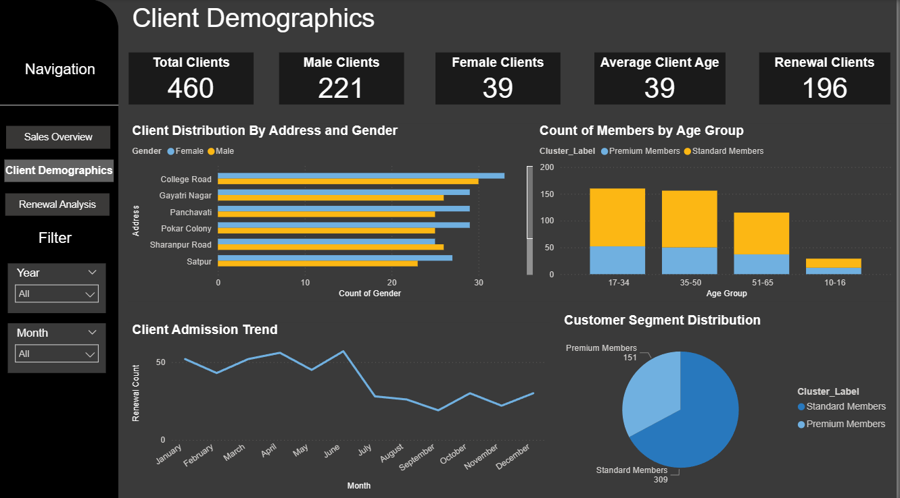
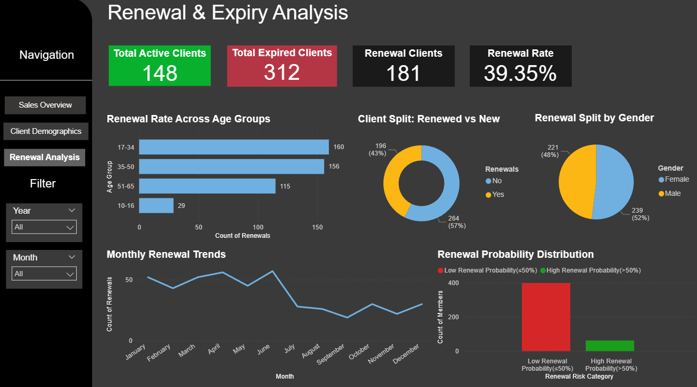

# Gym-Sales-Retention-Analysis

-Boosted revenue insight by 71% via K-means clustering (silhouette: 0.33), revealing that 33% of high-value premium members drive the
majority of sales.

-Identified 214 at risk customers using predictive modelling using Linear Regression on 460+ members records, enabling targeted retention strategies with 3.4L up grade revenue potential.

-Built an interactive Power BI dashboard with predictive analytics, customer segmentation, and renewal-risk analysis
using DAX calculations and Power Query data transformation, resulting in a 15% improvement in client retention.

Dashboard Screenshots:

📌 **Disclaimer:** Due to data privacy reasons, source data files and Power BI (.pbix) file are not included in this repository.
